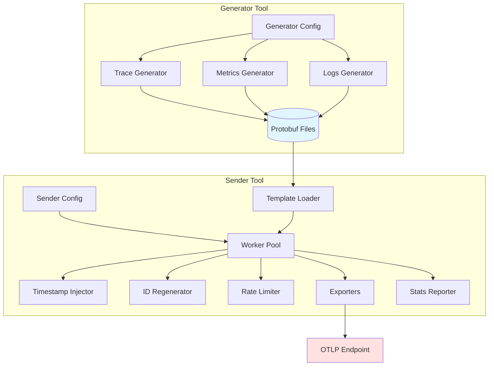
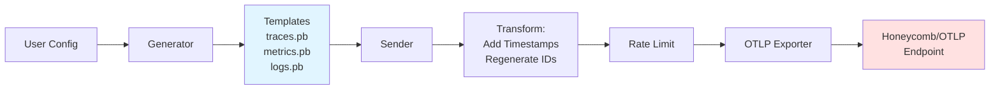
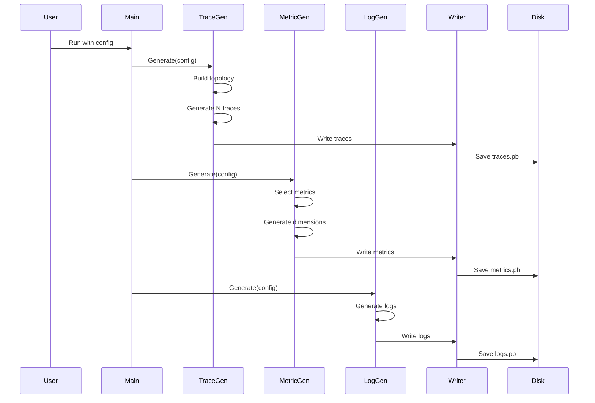
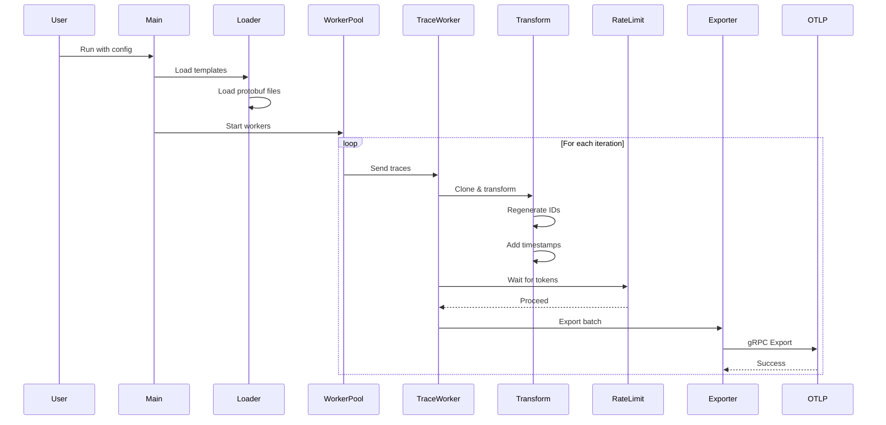
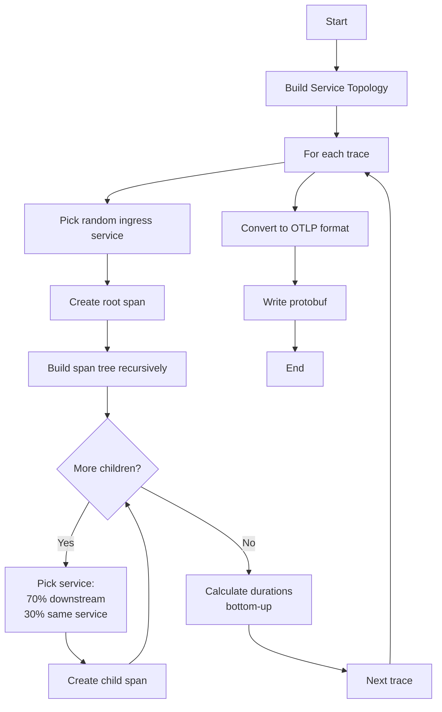
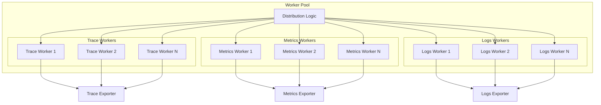
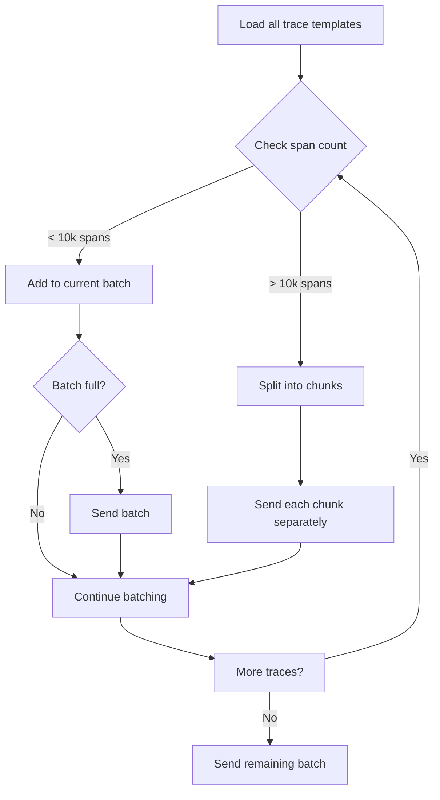
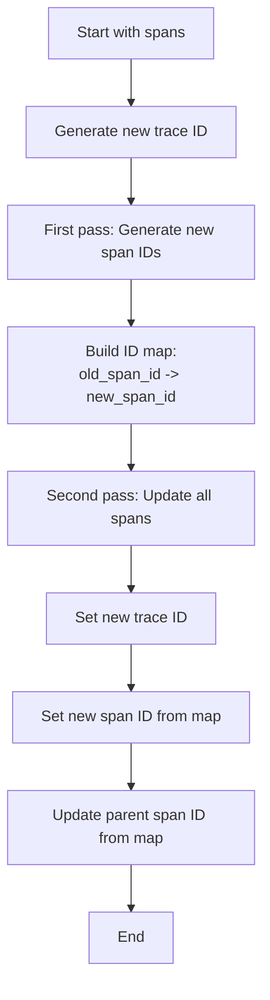
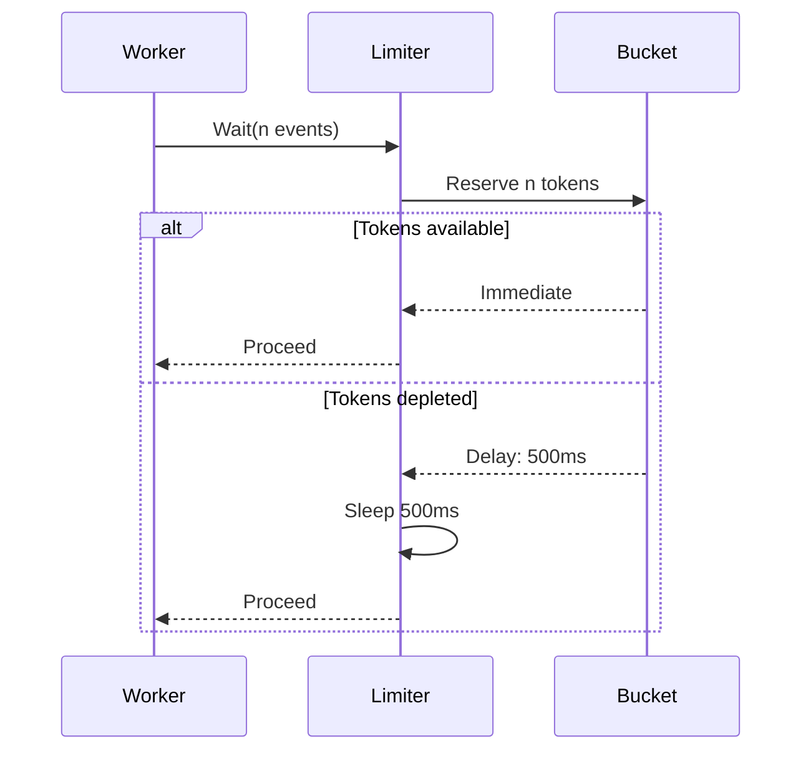
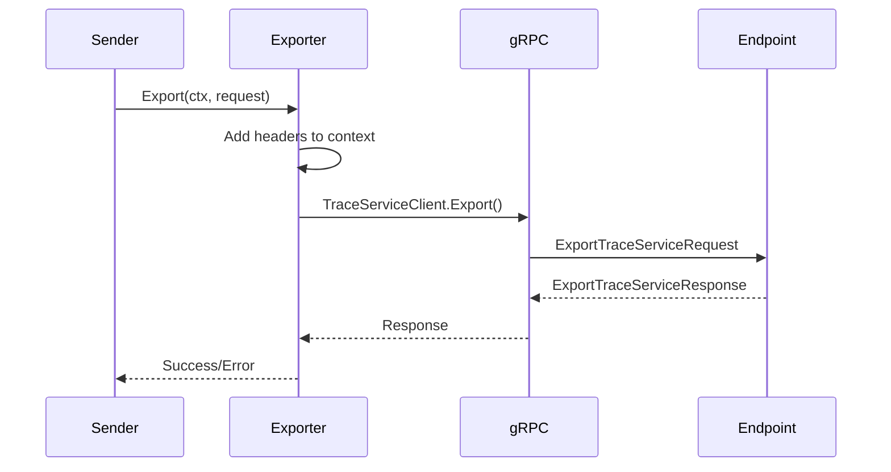

# Telemetry Generator and Sender - Architecture Documentation

## Table of Contents

1. [High-Level Overview](#high-level-overview)
2. [System Components](#system-components)
3. [Data Flow](#data-flow)
4. [Generator Architecture](#generator-architecture)
5. [Sender Architecture](#sender-architecture)
6. [Key Abstractions](#key-abstractions)
7. [Performance Considerations](#performance-considerations)
8. [Extension Points](#extension-points)

---

## High-Level Overview

This system is designed to generate and send high volumes of OpenTelemetry (OTLP) data for load testing and benchmarking observability platforms. It consists of two separate tools that work together:

1. **telemetry-generator**: Creates template telemetry data (traces, metrics, logs) and saves it as protobuf files
2. **telemetry-sender**: Loads templates and sends them to OTLP endpoints with configurable throughput

The separation allows you to generate data once and replay it many times, making it efficient to test at scale (target: 1M+ events/second per sender instance).

### Design Philosophy

- **Template-based generation**: Generate realistic data once, replay many times
- **Protobuf serialization**: Compact storage and fast loading
- **Configurable throughput**: Rate limiting and worker pools for controlled load
- **Signal separation**: Different workers for traces, metrics, and logs
- **No timestamps in templates**: Timestamps are added at send time for realistic "current" data

---

## System Components



---

## Data Flow

### Overall Data Flow



### Template Generation Flow



### Sending Flow



---

## Generator Architecture

### Components

#### 1. Main Generator (`cmd/telemetry-generator/main.go`)

**Purpose**: Entry point that orchestrates the generation of all telemetry types.

**Key Functions**:
- `main()`: Parses CLI flags, loads config, invokes generators
- `writeMetadata()`: Writes generation metadata to YAML

**Flow**:
1. Load configuration file
2. Create output directory
3. Generate traces (if configured)
4. Generate metrics (if configured)
5. Generate logs (if configured)
6. Write metadata file

#### 2. Trace Generator (`internal/generator/traces/`)

**Components**:
- `Generator`: Main coordinator
- `ServiceTopology`: Defines service relationships
- `SpanGenerator`: Creates span trees
- `TraceWriter`: Writes to protobuf

**Key Data Structures**:

```go
type Generator struct {
    config   *config.TracesConfig
    topology *ServiceTopology    // Service graph
    spanGen  *SpanGenerator      // Span generation logic
    writer   *TraceWriter        // File I/O
}

type ServiceTopology struct {
    Services        []*ServiceNode  // All services
    IngressServices []*ServiceNode  // Entry points
}

type ServiceNode struct {
    Name       string
    IsIngress  bool
    Operations []Operation        // HTTP, DB, Internal ops
    Downstream []*ServiceNode     // Services this can call
}

type TraceTemplate struct {
    TraceID   []byte
    RootSpan  *SpanNode         // Tree root
    SpanCount int
}

type SpanNode struct {
    SpanID     []byte
    ParentID   []byte
    Service    *ServiceNode
    Operation  Operation
    Duration   int64            // Nanoseconds
    StartTime  int64            // Relative offset
    Attributes []*commonpb.KeyValue
    Children   []*SpanNode      // Span tree
}
```

**Generation Algorithm**:



**Key Functions**:
- `BuildTopology()`: Creates service graph with ingress and downstream relationships
- `GenerateTrace()`: Creates one complete trace with normal distribution of spans
- `buildSpanTree()`: Recursively builds span hierarchy (depth-first)
- `calculateDurations()`: Bottom-up calculation of span durations
- `generateAttributes()`: Creates OpenTelemetry semantic attributes

#### 3. Metrics Generator (`internal/generator/metrics/`)

**Components**:
- `Generator`: Main coordinator
- `DimensionGenerator`: Creates dimension combinations
- `MetricsWriter`: Writes to protobuf

**Key Data Structures**:

```go
type Generator struct {
    config *config.MetricsConfig
    dimGen *DimensionGenerator
    writer *MetricsWriter
}

type MetricTemplate struct {
    Definition    MetricDefinition  // Name, type, unit
    DimensionSets []DimensionSet    // Time series combinations
}

type MetricDefinition struct {
    Name        string
    Description string
    Type        MetricType         // Gauge, Sum, Histogram
    Unit        string
}
```

**Generation Process**:
1. Select N metrics from available definitions (host metrics, k8s metrics)
2. For each metric, generate 100-500 dimension combinations (time series)
3. Each dimension set has different label values (hostname, pod name, etc.)
4. Write all metrics to single protobuf file

**Metric Types**:
- **Host Metrics**: CPU, memory, disk, network
- **K8s Cluster**: Node count, pod count, resource usage
- **K8s Node**: CPU, memory, network per node
- **K8s Pod**: Resource usage per pod
- **K8s Container**: Detailed container metrics

#### 4. Logs Generator (`internal/generator/logs/`)

**Components**:
- `Generator`: Main coordinator
- `LogTemplate`: Log structure with type and attributes
- Template functions for different log types

**Log Types** (configurable percentages):
- **HTTP Access Logs** (40%): Standard HTTP request logs
- **Application Logs** (40%): Structured logs with severity levels
- **System Logs** (20%): System-level events

**Key Functions**:
- `GenerateHTTPAccessLog()`: Creates HTTP request log with method, path, status
- `GenerateApplicationLog()`: Creates app log with severity (DEBUG, INFO, WARN, ERROR)
- `GenerateSystemLog()`: Creates system event log

---

## Sender Architecture

### Components

#### 1. Main Sender (`cmd/telemetry-sender/main.go`)

**Purpose**: Entry point that orchestrates loading, transformation, and sending.

**Flow**:
1. Load configuration
2. Load templates from protobuf files
3. Initialize exporters (gRPC clients)
4. Initialize transformers (timestamp, ID regeneration)
5. Initialize rate limiter
6. Start stats reporter
7. Create and run worker pool
8. Handle graceful shutdown

#### 2. Loader (`internal/sender/loader/loader.go`)

**Purpose**: Loads protobuf templates from disk.

**Key Functions**:
- `Load()`: Loads all configured template files
- `loadTraces()`: Unmarshals trace protobuf
- `loadMetrics()`: Unmarshals metrics protobuf
- `loadLogs()`: Unmarshals logs protobuf

**Output**: `Templates` struct containing all loaded OTLP data

#### 3. Worker Pool (`internal/sender/workers/pool.go`)

**Purpose**: Manages concurrent workers that send telemetry data.

**Architecture**:



**Worker Distribution Algorithm**:

Workers are automatically distributed based on data volume:

```go
// Calculate events for each signal type
traceEvents = count(spans in all traces)
metricEvents = count(data points in all metrics)
logEvents = count(log records)

// Distribute workers proportionally
traceWorkers = (numWorkers * traceEvents) / totalEvents
metricsWorkers = (numWorkers * metricEvents) / totalEvents
logsWorkers = (numWorkers * logEvents) / totalEvents

// Ensure minimum 1 worker per active signal type
```

**Key Functions**:
- `NewWorkerPool()`: Creates pool with calculated worker distribution
- `Run()`: Starts all workers with context and multiplier
- `traceWorker()`: Worker loop for sending traces
- `sendTraceBatch()`: Sends one batch with transformation

**Batch Management**:

For traces, intelligent batching prevents gRPC message size issues:



#### 4. Transformers

##### Timestamp Injector (`internal/sender/transformer/timestamps.go`)

**Purpose**: Adds current timestamps to telemetry data at send time.

**Key Behaviors**:
- **Traces**: Preserves relative timing relationships between spans
  - Extracts template timing metadata (`_template.start_offset_nanos`, `_template.duration_nanos`)
  - Calculates trace start time based on current time
  - Applies span offsets and durations
  - Adds configurable jitter
- **Metrics**: Adds single timestamp to all data points
- **Logs**: Adds timestamp with jitter to each log record

**Configuration**:
- `jitterMs`: Random variance added to timestamps (0-N milliseconds)
- `backdateMs`: Shifts timestamps into the past for historical data testing

##### ID Regenerator (`internal/sender/transformer/ids.go`)

**Purpose**: Regenerates trace and span IDs while preserving relationships.

**Algorithm**:



**Why This Matters**: Ensures each send creates unique traces/spans while maintaining parent-child relationships.

#### 5. Rate Limiter (`internal/sender/ratelimit/limiter.go`)

**Purpose**: Controls throughput to prevent overwhelming the OTLP endpoint.

**Implementation**: Token bucket algorithm (via `golang.org/x/time/rate`)



**Configuration**:
- `eventsPerSecond`: Target rate
- Burst capacity: 2x the rate (handles bursty workloads)

**Behavior**:
- Disabled if `eventsPerSecond <= 0`
- Waits proportional to number of events being sent
- Context-aware (cancels on shutdown)

#### 6. Exporters (`internal/sender/exporter/`)

**Purpose**: Send telemetry data to OTLP endpoint via gRPC.

**Components**:
- `TraceExporter`: Exports traces
- `MetricsExporter`: Exports metrics
- `LogsExporter`: Exports logs

**Key Features**:
- gRPC connection management
- TLS support (configurable)
- Header injection (e.g., API keys)
- Error handling and reporting

**Protocol**: OpenTelemetry Protocol (OTLP) over gRPC



#### 7. Stats Reporter (`internal/sender/stats/reporter.go`)

**Purpose**: Tracks and reports sending statistics in real-time.

**Tracked Metrics**:
- Traces sent (span count)
- Metrics sent (data point count)
- Logs sent (log record count)
- Errors
- Elapsed time
- Current rate (events/second)

**Reporting**:
- Periodic reports every 5 seconds during operation
- Final summary on shutdown
- Thread-safe atomic counters

---

## Key Abstractions

### 1. Templates

Templates are telemetry data **without timestamps**. This design allows:
- Generate once, replay many times
- Consistent data for benchmarking
- Minimal storage (no redundant timestamp data)

### 2. Protobuf Serialization

Using OpenTelemetry's protobuf format provides:
- **Compact storage**: Binary format is smaller than JSON
- **Fast loading**: Direct unmarshaling to Go structs
- **OTLP compatibility**: Templates are valid OTLP requests (minus timestamps)

### 3. Worker Specialization

Workers are divided by signal type for:
- **Realistic load patterns**: Different signals have different characteristics
- **Independent scaling**: Scale trace workers independently from metrics workers
- **Optimized batching**: Each signal type has its own batching logic

### 4. Deep Copying

Before each send, templates are deep copied to:
- **Enable concurrent sending**: Multiple workers can send simultaneously
- **Prevent race conditions**: Each worker modifies its own copy
- **Support ID regeneration**: Original template IDs remain unchanged

---

## Performance Considerations

### Memory Management

**Generator**:
- Builds telemetry in memory before writing
- Memory limit: 10GB maximum dataset size
- Tracks estimated sender memory usage

**Sender**:
- Loads all templates into memory at startup
- Deep copies for each send (memory overhead)
- Rate limiter prevents memory exhaustion from queuing

### Throughput Optimization

**Factors affecting throughput**:
1. **Worker count**: More workers = higher throughput (up to rate limit)
2. **Rate limit**: Hard cap on events/second
3. **Batch size**: Larger batches = fewer gRPC calls
4. **Network latency**: Distance to OTLP endpoint
5. **Template size**: Smaller templates = faster processing

**Batching Strategy**:
- Traces: Batch by resource spans (max 10k spans/batch)
- Metrics: Send all metrics in single request
- Logs: Send all logs in single request

**Concurrency Model**:
- Multiple goroutines per signal type
- Lock-free where possible (atomic counters)
- Context-based cancellation

### Span-Count-Aware Batching

High span count traces are automatically split:

```go
// If trace has > 10k spans:
// 1. Flush any pending batch
// 2. Split trace into chunks of 10k spans
// 3. Send each chunk as separate batch
// This prevents gRPC "message too large" errors
```

---

## Extension Points

### Adding New Telemetry Types

To add a new telemetry type (e.g., profiles):

1. **Generator**:
   - Create `internal/generator/profiles/generator.go`
   - Implement `Generate()` method
   - Add writer to save protobuf
   - Wire up in `cmd/telemetry-generator/main.go`

2. **Sender**:
   - Create `internal/sender/exporter/profiles.go`
   - Add loader in `internal/sender/loader/loader.go`
   - Add worker type in `internal/sender/workers/pool.go`
   - Wire up in `cmd/telemetry-sender/main.go`

### Adding New Metric Types

Edit `internal/generator/metrics/schema.go`:

```go
func GetAllAvailableMetrics() []MetricDefinition {
    // Add new metric definitions here
    return []MetricDefinition{
        {
            Name: "your.new.metric",
            Type: MetricTypeGauge,
            Unit: "units",
            // ...
        },
    }
}
```

### Adding New Attributes

Edit `internal/generator/common/attributes.go`:

```go
func GenerateCustomAttributeSchemas(count int) []AttributeSchema {
    // Add new attribute schemas here
}
```

### Custom Transformers

Implement the transformer interface:

```go
type Transformer interface {
    Transform(data interface{}) error
}
```

Then add to worker pool pipeline in `internal/sender/workers/pool.go`.

---

## Configuration Reference

### Generator Config Structure

```yaml
output:
  directory: "./generated"
  prefix: "telemetry"

traces:
  count: 10000
  spans:
    avg_per_trace: 15
    std_dev: 5
  services:
    count: 5
    names: ["api", "db", "cache"]

metrics:
  metric_count: 2000
  timeseries_per_metric:
    min: 100
    max: 500
    default: 300

logs:
  count: 50000
  types:
    http_access:
      percentage: 40
    application:
      percentage: 40
    system:
      percentage: 20
```

### Sender Config Structure

```yaml
input:
  traces: "./generated/telemetry-traces.pb"
  metrics: "./generated/telemetry-metrics.pb"
  logs: "./generated/telemetry-logs.pb"

otlp:
  endpoint: "api.honeycomb.io:443"
  headers:
    x-honeycomb-team: "${HONEYCOMB_API_KEY}"

sending:
  rate_limit:
    events_per_second: 10000
  batch_size:
    traces: 100
    metrics: 1000
    logs: 1000
  concurrency: 10
  duration: "5m"        # Max duration (0 = no limit)
  multiplier: 10        # Replay count (0 = infinite)

timestamps:
  jitter_ms: 100
  backdate_ms: 0
```

---

## Debugging Tips

### Viewing Template Contents

Generate with `--json` flag:

```bash
./telemetry-generator --config config.yaml --json
```

This creates `.json` files alongside `.pb` files for inspection.

### Verifying Templates

Check metadata file:

```bash
cat generated/telemetry-metadata.yaml
```

Shows generation stats and file locations.

### Monitoring Sender

Stats are printed every 5 seconds:

```
[15:04:05] Stats:
  Trace spans sent: 150000
  Metrics sent: 600000
  Logs sent: 500000
  Total events: 1250000
  Errors: 0
  Elapsed: 25s
  Overall rate: 50000 events/sec
  Recent rate: 52000 events/sec
```

### Common Issues

**"Message too large" errors**:
- Reduce `batch_size.traces`
- System automatically splits traces >10k spans

**Low throughput**:
- Increase `concurrency`
- Increase `rate_limit.events_per_second`
- Check network latency to endpoint

**High memory usage**:
- Reduce dataset size in generator
- Reduce `multiplier` in sender
- Check for memory leaks with `pprof`

---

## Architecture Decisions

### Why Separate Generator and Sender?

1. **Generate once, replay many**: Avoids regenerating data for each test
2. **Resource efficiency**: Generation is CPU-intensive, sending is network-intensive
3. **Consistent testing**: Same data every time ensures reproducible benchmarks
4. **Storage optimization**: Templates are compact without timestamps

### Why No Timestamps in Templates?

1. **Realism**: Timestamps added at send time = "current" data
2. **Compactness**: Saves storage space
3. **Flexibility**: Configure backdate/jitter without regenerating

### Why Deep Copy Templates?

1. **Concurrency**: Multiple workers can send simultaneously
2. **ID uniqueness**: Each send gets unique trace/span IDs
3. **Timestamp variance**: Each send gets different timestamps

### Why Token Bucket Rate Limiting?

1. **Smooth throughput**: Prevents bursty traffic
2. **Burst tolerance**: 2x burst capacity handles variability
3. **Simplicity**: Well-understood algorithm with good libraries

### Why Worker Specialization?

1. **Realistic load**: Different signals have different characteristics
2. **Optimized batching**: Each type has different optimal batch size
3. **Independent scaling**: Scale hot paths independently

---

## Future Enhancements

### Potential Improvements

1. **Streaming generation**: Generate and send without intermediate storage
2. **Compression**: Compress protobuf files for reduced storage
3. **Partial template loading**: Load batches of templates to reduce memory
4. **Dynamic rate adjustment**: Adjust rate based on endpoint response times
5. **More telemetry types**: Add support for profiling data, custom events
6. **Advanced topology**: Support more complex service graphs (fan-out, cycles)
7. **Cardinality explosion**: Generate high-cardinality scenarios for testing
8. **Error injection**: Generate spans with errors, failed requests
9. **Trace sampling**: Generate pre-sampled traces
10. **Metrics aggregation**: Pre-aggregate metric data points

---

## Glossary

- **OTLP**: OpenTelemetry Protocol - standard for telemetry data exchange
- **Protobuf**: Protocol Buffers - binary serialization format
- **Template**: Telemetry data without timestamps, ready for replay
- **Resource Span**: OTLP container for spans from a single resource
- **Scope Span**: OTLP container for spans from a single instrumentation scope
- **Time Series**: Unique combination of metric name and dimension values
- **Cardinality**: Number of unique dimension combinations
- **Trace ID**: 16-byte identifier for a distributed trace
- **Span ID**: 8-byte identifier for a single span
- **Jitter**: Random variance added to timestamps
- **Multiplier**: Number of times to replay templates

---

## Conclusion

This architecture provides a scalable, configurable system for load testing observability platforms. The separation of generation and sending, combined with template-based replay and intelligent worker distribution, enables high-throughput testing with minimal resource usage.

For questions or contributions, see the main [README.md](./README.md).
